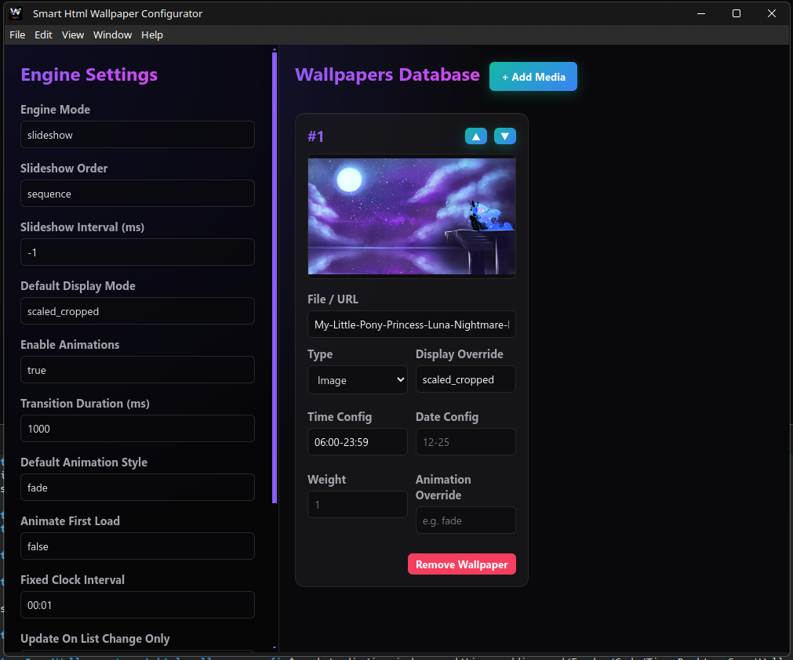

<center></center>

# 🌟 Smart Html Wallpaper Engine

A highly customizable, lightweight Node.js wallpaper engine with responsive ElectronJS Graphic User Interface! Set up your wallpapers to change based on specific times, dates, probability weights, and enjoy beautiful transitions between images, videos, and web pages.

## 🚀 Features
- **Media Support**: Load images, videos (with volume control), and web pages (iframes).
- **Animations**: Configurable transitions (`fade`, `slide_left`, `slide_right`, `zoom_in`).
- **Scheduling**: Priority wallpapers for specific times or dates.
- **Advanced Scheduling**: Set specific dates or time ranges (e.g., `21:00-03:00` safely crossing midnight!).
- **Probability Weights**: Make specific wallpapers appear more often during random slideshows.
- **Visual Desktop Configurator**: An ElectronJS app to visually drag-and-drop your wallpaper database and manage engine settings with real-time validation.

## 🛠️ How to Use (Development)

1. **Install dependencies:**
   Run `npm install` in the root folder.

2. **Run the Configurator App:**
   Run `npm start` to open the visual interface.
   
3. **Configure & Build:**
   Use the GUI to set your engine parameters and add your wallpapers. Once you click **"Save & Build"**, the app uses `esbuild` to instantly generate your static, lightning-fast engine in the `/dist` folder.

4. **Run the Engine:**
   Serve the `/dist` folder with Apache2 or load the `index.html` directly into your desktop environment!

## 🎨 Display Modes Available
- `scaled_cropped`: Fills the screen perfectly, keeping it centered.
- `scaled`: Fits the entire image inside the screen.
- `cropped`: Original size, but centered.
- `normal`: Stretches to fit the screen bounds.
- `tiled`: Repeats the image across the screen.

## 🛠️ Configuration

### Global Settings (`.env`)
- `ANIMATIONS_ENABLED`: Set to "true" to enable transitions.
- `TRANSITION_DURATION`: Time in milliseconds.
- `ANIMATE_FIRST_LOAD`: If "true", the very first wallpaper will also animate in.

### Advanced Timing Triggers (`.env`)
You can control exactly WHEN the engine checks for the next wallpaper:
- `SLIDESHOW_INTERVAL`: Standard interval in milliseconds (e.g., `60000` for 1 minute).
- `FIXED_CLOCK_INTERVAL`: Set to perfectly sync with the clock (e.g., `"01:30"` checks exactly every 1 hour and 30 minutes from the start of the day). Both intervals can run simultaneously!
- `ON_LIST_CHANGE_ONLY`: If set to `"true"`, it disables all intervals above. The engine will check quietly every minute in the background, and will ONLY animate and update the screen if a wallpaper enters or leaves the active time/date range.

### Individual Settings (`wallpapers.json`)
You can define specific properties for each wallpaper:
- `type`: Must be `"image"`, `"video"`, or `"web"`.
- `time`: Set an exact time (`"15:00"`) or a time range (`"21:00-03:00"`). It handles midnight crossings automatically!
- `date`: Set a specific date (`"12-25"`).
- `muted`: Boolean (video only).
- `volume`: 0.0 to 1.0 (video only).
- `animation`: Overrides the global default animation.
- `weight`: Number to define random probability. Default is 1. A weight of 10 means it's 10x more likely to appear.

## 📦 Building the Standalone Application

You can compile the configurator into a standalone executable (AppImage for Linux, .exe for Windows, and .dmg for macOS).

1. Place your app icons in the `favicon/` folder (`icon.png`, `icon.ico`, `icon.icns`).
2. Run the build command:
   ```bash
   npm run build:app
   ```

3. Your compiled applications will be available inside the `release/` folder!

*(Note: Building the macOS `.dmg` installer requires running the build script on a macOS machine).*

## ⚙️ Core Logic Files

* `.env` / `example.env`: Holds global configuration parameters.
* `wallpapers.json`: The database array holding individual media properties.
* `gui/`: Contains the Electron interface to manage everything safely.

## 🐧 Compatibility
To be completely transparent, this software was developed and fully tested exclusively on **Linux Kubuntu**. While the build system supports compiling for Windows (.exe) and macOS (.dmg), the primary environment and guaranteed stable experience is on Kubuntu.

### 🖥️ Tested Environments

We want to ensure your dynamic wallpapers run perfectly! Currently, this project has been personally tested and works on:

* [HTML Wallpaper (KDE Store)](https://store.kde.org/p/1324580)

---

## Enjoy your new dynamic desktop!

<center></center>

---

## 💡 Credits

> 🧠 **Note**: This documentation was written by [Gemini](https://gemini.google.com), an AI assistant developed by Google, based on the project structure and descriptions provided by the repository author.  
> If you find any inaccuracies or need improvements, feel free to contribute or open an issue!
